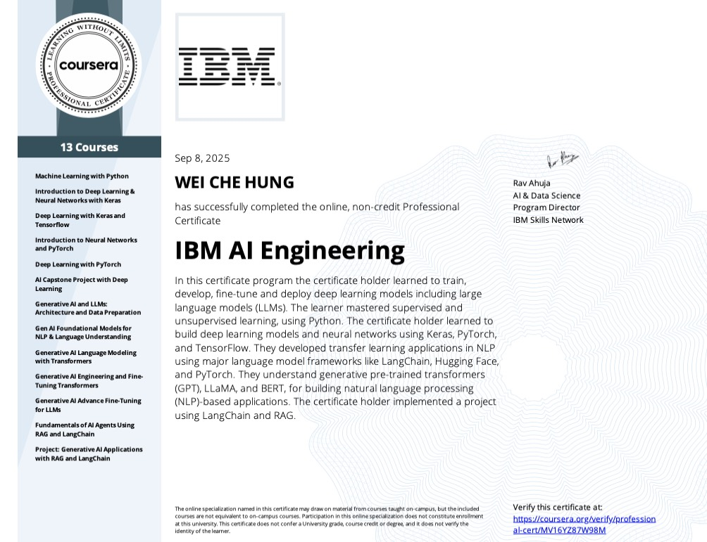

# Hands-On AI Engineering Notebooks – IBM / Coursera Labs Showcase
---

## IBM Generative AI Engineering Professional Certificate
---

- [Cert Link](https://www.credly.com/org/ibm/badge/ibm-generative-ai-engineering-professional-certific)

---

This repository contains my curated **Jupyter notebooks** from the IBM AI Engineering Professional Certificate (Coursera).  
They represent my **hands-on practice** in building, training, and evaluating machine learning and deep learning models.

## 🚀 Highlights
- Applied **Machine Learning** with scikit-learn  
- Built **Neural Networks & Deep Learning models** with PyTorch and TensorFlow  
- Worked with **Computer Vision & CNNs**  
- Hands-on **NLP with word embeddings and transformers**  
- Practical exposure to **MLOps concepts** (model evaluation, deployment basics)

## 🎯 Purpose
- Showcase applied AI/ML engineering skills to hiring managers & data leaders  
- Document my **learning journey and portfolio projects**  
- Provide open examples of **practical Jupyter workflows**

## 📜 License
Distributed under the **Creative Commons Attribution-NonCommercial 4.0 (CC BY-NC 4.0)** license.  
This means the work can be **shared and adapted** with attribution, but **not used commercially**.

---

# ja_ai_engineer_notebooks
Collection of Jupyter Note from the IBM AI Engineering Professional Certificate (Coursera). This repository demonstrates my hands-on experience in machine learning, deep learning, NLP, and model deployment using PyTorch, TensorFlow, and scikit-learn. Serves as a portfolio showcase to highlight skills in AI engineering, data science, and MLOps.
